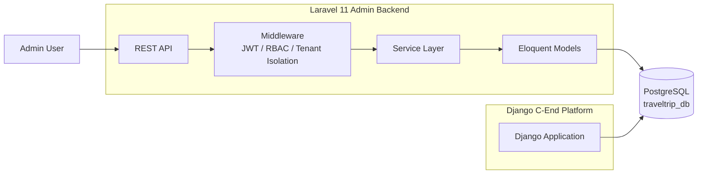

# TravelHub Admin SaaS

PHP 8.3 / Laravel 11 / PostgreSQL

企業級旅遊 SaaS 後台管理系統，提供多租戶組織管理、
角色權限、行程與訂單管理，以及操作紀錄等 REST API。

## Features

- Multi-Tenant Organization Management
- JWT Authentication
- Role-Based Access Control (RBAC)
- Trip & Booking Management
- Audit Logging
- PostgreSQL
- Service Layer Architecture

## Architecture

[架構圖]
## Architecture

## API

### Authentication

## API

### Authentication
POST /api/auth/login
POST /api/auth/refresh
POST /api/auth/logout

### Membership
GET /api/v1/memberships
POST /api/v1/memberships
DELETE /api/v1/memberships/{id}

### Trips & Bookings
GET /api/v1/trips
POST /api/v1/trips
DELETE /api/v1/trips/{id}
GET /api/v1/bookings
PATCH /api/v1/bookings/{id}

## Technical Highlights

### Multi-Tenant Data Isolation
透過 organization_id 建立租戶資料隔離，
並在 Middleware / Eloquent 查詢層統一處理。

### Authentication & Authorization
使用 JWT、Refresh Token 與 RBAC，
將認證與權限驗證放在 Middleware 處理。

### Service Layer
將認證、Token refresh 等業務邏輯抽離至 Service，
降低 Controller 複雜度。

### Cross-Framework Integration
Laravel Admin 與既有 Django C端平台共用
Trips / Bookings 業務資料表。

## Testing

使用 PHPUnit / Laravel Test Framework
進行 API 與核心業務邏輯測試。

## Tech Stack

PHP 8.3
Laravel 11
PostgreSQL 15
JWT
PHPUnit
Vite / Tailwind CSS
